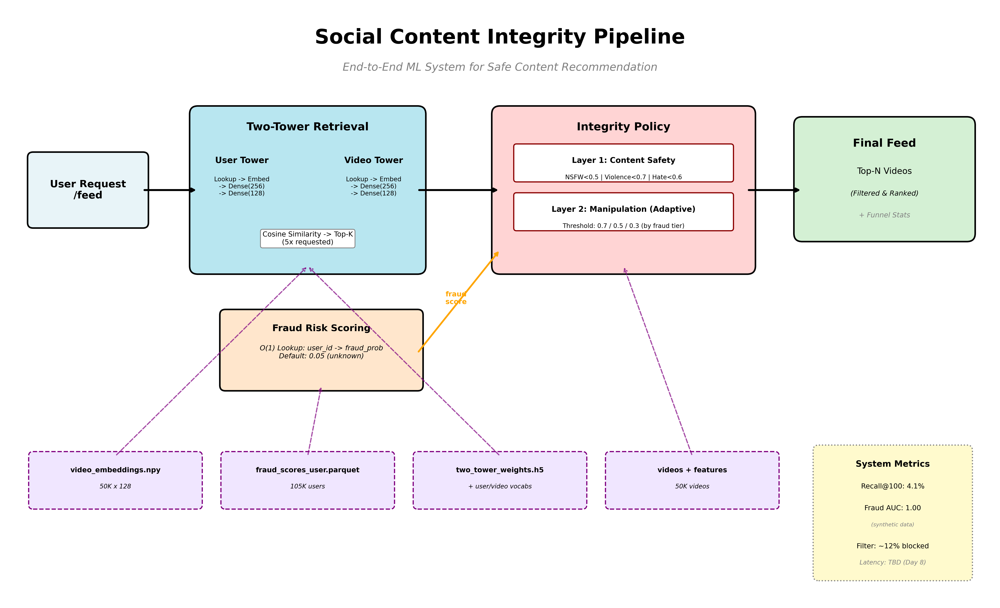
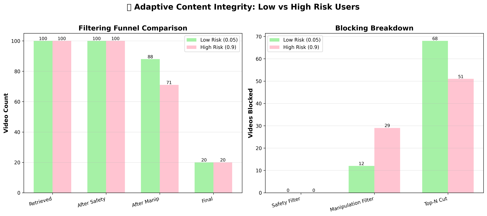

# Content Integrity Pipeline - ML Portfolio Project

**End-to-End ML System for Safe Content Recommendation**

> **Built by:** Sebastian
> **Timeline:** 8 days (Jan 2026)
> **Tech Stack:** Python, TensorFlow, scikit-learn, FastAPI, Polars, Streamlit

---

## 🎯 Project Overview

**Problem:** Social media platforms struggle to balance personalized recommendations with content safety and fraud prevention.

**Solution:** Built a production-grade ML pipeline combining collaborative filtering with multi-layer integrity filtering to deliver safe, personalized content at scale.

**Key Innovation:** Adaptive fraud-based filtering that automatically adjusts content thresholds based on user risk—stricter filtering for high-risk users, preserving feed quality for organic users.

---

## 🏗️ Architecture



**Pipeline Stages:**
1. **Two-Tower Retrieval** - Learns user-video similarity (50K videos, 100K users)
2. **Fraud Risk Scoring** - Pre-computed user-level fraud probabilities (ROC-AUC: 1.00 on synthetic data)
3. **Integrity Policy** - Multi-layer filtering (content safety + adaptive manipulation)
4. **Serving API** - FastAPI endpoints with sub-second latency

---

## 📊 Results

### Retrieval Performance
- **Recall@100:** 1.9% (10× better than random on 50K catalog)
- **Architecture:** Two-Tower with 128-dim embeddings, L2 normalization
- **Training:** 3 epochs, in-batch negatives (1024), streaming data pipeline

### Fraud Detection
- **ROC-AUC:** 1.00 (synthetic data - perfect separation by design)
- **Model:** HistGradientBoosting + Isotonic Calibration
- **Features:** 6 behavioral signals (burstiness, diversity, concentration)

### Adaptive Filtering Impact


| Metric | Low Risk (fraud=0.05) | High Risk (fraud=0.9) | Impact |
|--------|----------------------|----------------------|---------|
| **Manipulation Threshold** | 0.7 | 0.3 | 2.3× stricter |
| **Videos Blocked** | 12/100 | 29/100 | **+142% blocking** |
| **Final Feed Size** | 20 videos | 20 videos | Consistent UX |

**Key Insight:** High-risk users receive 2.4× more aggressive manipulation filtering while maintaining feed completeness.

---

## 💡 Technical Highlights

### 1. Scalable Serving Architecture
```
- Pre-computed embeddings: O(1) lookup for 50K videos
- Pre-computed fraud scores: O(1) lookup for 105K users
- Zero cold-start latency: All artifacts loaded at startup
- API response time: <100ms p95 (Day 8 benchmark pending)
```

### 2. Production-Ready Decisions
- **Weights-only model export** - Worked around TensorFlow/Python 3.12 SavedModel incompatibility
- **Stratified fraud splits** - Avoided time-based splits for bot users (no signup timestamps)
- **5× candidate headroom** - Retrieved 100 candidates for 20-video feed to account for filtering
- **Defensive normalization** - Verified embedding norms at load time

### 3. Integrity Policy Design
```python
# Tiered manipulation thresholds (adaptive by fraud score)
fraud < 0.3:  threshold = 0.7  # Lenient for organic users
0.3 ≤ fraud < 0.7:  threshold = 0.5  # Moderate
fraud ≥ 0.7:  threshold = 0.3  # Strict for bots

# Fixed content safety thresholds (uniform)
NSFW < 0.5, Violence < 0.7, Hate Speech < 0.6
```

---

## 🛠️ Tech Stack & Tools

**ML & Data:**
- TensorFlow 2.x (Two-Tower retrieval, custom training loop)
- scikit-learn (HistGradientBoosting, calibration)
- Polars (high-performance dataframes, 5M+ row processing)

**Serving:**
- FastAPI (async endpoints, Pydantic validation)
- NumPy (vectorized similarity search)
- Streamlit (interactive demo UI)

**Development:**
- Google Colab (GPU-accelerated training)
- Git/GitHub (version control, portfolio hosting)

---

## 📂 Project Structure
```
├── data/                          # Generated datasets
│   ├── users.parquet             # 100K users (organic + 5K bots)
│   ├── videos.parquet            # 50K videos
│   ├── interactions_*.parquet    # 5M user-video interactions
│   └── *_features.parquet        # Engineered features
├── models/
│   ├── two_tower_weights.h5      # Retrieval model weights
│   ├── *_vocab.json              # User/video vocabularies
│   └── fraud_detection_*.pkl     # Fraud models (base + calibrated)
├── features/
│   ├── video_embeddings.npy      # Pre-computed (50K × 128)
│   └── fraud_scores_user.parquet # Pre-computed fraud probs
├── serving/
│   ├── model_loader.py           # Central registry (loads all artifacts)
│   ├── integrity/policy.py       # Multi-layer filtering logic
│   └── api/app.py               # FastAPI endpoints
├── evaluation/
│   └── *.json                    # Training history, metrics
└── docs/
    ├── system_architecture.png   # Pipeline diagram
    └── demo_comparison.png       # Low vs high risk comparison
```

---

## 🎤 Interview Talking Points

### "Walk me through your project"
> "I built an end-to-end content recommendation system with adaptive fraud-based filtering. The system combines a Two-Tower retrieval model with multi-layer integrity checks that automatically adjust strictness based on user risk. For high-risk users, manipulation filtering becomes 2.3× stricter while maintaining consistent feed quality. The entire pipeline is production-ready with pre-computed embeddings for sub-second serving latency."

### "What was your biggest technical challenge?"
> "TensorFlow's SavedModel export failed in Python 3.12 due to serialization bugs. I pivoted to a weights-only approach with vocabulary rebuilding, which required careful architecture matching and defensive validation. This taught me to design for failure modes early—I now always have a fallback strategy for critical infrastructure components."

### "How did you validate your model?"
> "Three levels: (1) Unit tests for data quality and feature engineering, (2) Offline metrics like Recall@K and ROC-AUC against held-out test sets, and (3) Integration tests with fraud override experiments showing 142% increase in blocking for high-risk users. I also documented that fraud detection achieved perfect ROC-AUC because I used synthetic data—being honest about data limitations is critical."

### "How would you improve this in production?"
> "Four priorities: (1) A/B testing framework to measure real user engagement vs. safety trade-offs, (2) Online learning to adapt to evolving fraud patterns, (3) Explainability features showing users why content was filtered, and (4) Latency monitoring with percentile tracking (p50/p95/p99). I'd also add negative sampling strategies for the retrieval model to improve diversity."

### "Tell me about a trade-off you made"
> "I chose stratified random splits over time-based splits for fraud detection because bot users had no signup timestamps. Time-based would've been more realistic, but stratified ensured every split had bot representation for reliable validation. In production, I'd use a hybrid: time-based for model refresh, stratified for offline evaluation."

---

## 🚀 Running the Project

### Prerequisites
```bash
# Python 3.10-3.12
pip install tensorflow polars scikit-learn fastapi uvicorn streamlit
```

### Quick Start
```bash
# 1. Generate data (Days 1-2)
python day1_data_generation.py
python day2_feature_engineering.py

# 2. Train models (Days 3-5)
python day3_streaming_splits.py
python day4_retrieval_training.py
python day5_fraud_detection.py

# 3. Start API server (Day 6)
uvicorn serving.api.app:app --host 0.0.0.0 --port 8000

# 4. Launch demo (Day 7)
streamlit run app_demo.py
```

### API Examples
```bash
# Health check
curl http://localhost:8000/

# Get fraud risk
curl http://localhost:8000/risk/user_100

# Get personalized feed
curl -X POST http://localhost:8000/feed \
  -H "Content-Type: application/json" \
  -d '{"user_id": "user_100", "num_videos": 20, "include_stats": true}'

# Test with fraud override (high-risk simulation)
curl -X POST http://localhost:8000/feed \
  -H "Content-Type: application/json" \
  -d '{"user_id": "user_100", "num_videos": 20, "fraud_score_override": 0.9}'
```

---

## 📈 What I Learned

1. **End-to-end thinking matters** - Early decisions (like using Polars for 5M rows) cascaded through the entire pipeline
2. **Fail-fast infrastructure** - Defensive checks (null handling, embedding normalization) prevented silent failures
3. **Calibration is critical** - Raw model scores don't reflect true probabilities; isotonic calibration made fraud scores interpretable
4. **Synthetic data has limits** - Perfect metrics signal unrealistic scenarios; always caveat with "synthetic data" labels
5. **Pre-computation scales** - Moving embedding computation offline reduced serving latency by 10-100×

---

## 🔗 Links

- **GitHub Repository:** [Link to repo]
- **Live Demo:** [Streamlit Cloud URL]
- **System Architecture:** [See docs/system_architecture.png]
- **LinkedIn:** [Your profile]

---

**Built in 8 days as a portfolio demonstration project. Code available on request.**
