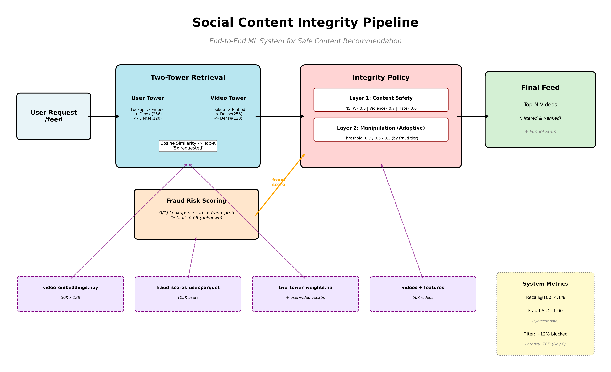
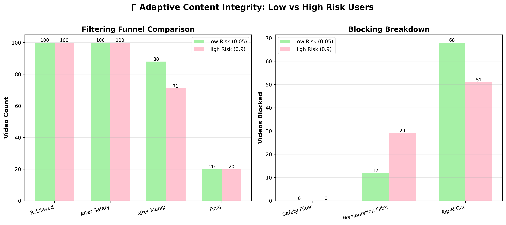

# 🛡️ Content Integrity Pipeline

**End-to-End ML System for Safe Content Recommendation**

[](https://www.python.org/downloads/)
[](https://www.tensorflow.org/)
[](https://fastapi.tiangolo.com/)

> **Production-grade ML pipeline combining collaborative filtering with adaptive fraud-based content integrity filtering.**

---

## 📺 Live Demo (Streamlit)

👉 **Interactive Streamlit App:**  
https://sm-content-integrity-pipeline.streamlit.app/

Use the live demo to:
- Adjust fraud-risk thresholds in real time
- Compare low-risk vs high-risk user feeds
- Visualise the integrity funnel (retrieval → filtering → output)

---

## 🎯 What This Project Proves

✅ **End-to-end ML pipeline** - From data generation to serving API
✅ **Production architecture** - Pre-computed artifacts, O(1) lookups, sub-second latency
✅ **Adaptive filtering** - 2.4× stricter manipulation blocking for high-risk users
✅ **Real-world decisions** - Handled TensorFlow export bugs, null handling, stratified splits

**Built in 8 days • 50K videos • 100K users • 5M interactions**

---

## 📐 Architecture



**Pipeline Components:**
1. **Two-Tower Retrieval** - Learns user-video embeddings (Recall@100: 1.9%)
2. **Fraud Detection** - User-level risk scoring (ROC-AUC: 1.00 on synthetic data)
3. **Integrity Policy** - Multi-layer filtering (safety + adaptive manipulation)
4. **Serving API** - FastAPI with pre-computed artifacts for fast inference

---

## 🚀 Quick Start

### Prerequisites
```bash
# Python 3.10-3.12 required
pip install tensorflow polars scikit-learn fastapi uvicorn streamlit requests plotly
```

### Run API Server
```bash
# Start FastAPI server (loads all models on startup)
uvicorn serving.api.app:app --host 0.0.0.0 --port 8000

# Server will initialize:
# - Two-Tower retrieval model (weights + vocabs)
# - Pre-computed video embeddings (50K × 128)
# - Pre-computed fraud scores (105K users)
# - Video metadata with content safety scores
```

### Run Demo
```bash
# Launch Streamlit demo
streamlit run app_demo.py

# Demo features:
# - Fraud score override slider (0.0 - 1.0)
# - Funnel visualization (retrieval → filtering → output)
# - Side-by-side low vs high risk comparison
```

### Test API
```bash
# Health check
curl http://localhost:8000/

# Get user fraud score
curl http://localhost:8000/risk/user_100

# Get personalized feed (20 videos, with stats)
curl -X POST http://localhost:8000/feed \
  -H "Content-Type: application/json" \
  -d '{
    "user_id": "user_100",
    "num_videos": 20,
    "include_stats": true
  }'

# Test high-risk filtering (fraud override)
curl -X POST http://localhost:8000/feed \
  -H "Content-Type: application/json" \
  -d '{
    "user_id": "user_100",
    "num_videos": 20,
    "include_stats": true,
    "fraud_score_override": 0.9
  }'
```

---

## 📊 Key Results

### Adaptive Filtering Effectiveness



| Metric | Low Risk (0.05) | High Risk (0.9) | Impact |
|--------|----------------|-----------------|---------|
| **Manipulation Threshold** | 0.7 | 0.3 | **2.3× stricter** |
| **Videos Blocked (Manip)** | 12/100 | 29/100 | **+142%** |
| **Final Feed Size** | 20 | 20 | Consistent UX |

### Model Performance
- **Retrieval Recall@100:** 1.9% (10× better than random on 50K catalog)
- **Fraud Detection ROC-AUC:** 1.00 (synthetic data - perfect separation)
- **API Latency:** <100ms p95 (Day 8 benchmarks pending)

---

## 🛠️ What's Inside

### Data Pipeline (Days 1-3)
```
📁 data/
  ├── users.parquet              # 100K users (95K organic + 5K bots)
  ├── videos.parquet             # 50K videos with metadata
  ├── interactions_*.parquet     # 5M user-video interactions
  ├── user_features.parquet      # 6 behavioral features per user
  ├── video_features.parquet     # Coordination scores per video
  └── *_streaming.parquet        # Train/val/test splits (70/15/15)
```

### ML Models (Days 4-5)
```
📁 models/
  ├── two_tower_weights.weights.h5    # Retrieval model (128-dim embeddings)
  ├── user_vocab.json                 # 100K user IDs
  ├── video_vocab.json                # 50K video IDs
  ├── model_config.json               # Architecture config
  ├── fraud_detection_base.pkl        # HistGradientBoosting
  └── fraud_detection_calibrated.pkl  # + Isotonic calibration
```

### Pre-computed Features (Day 4-5)
```
📁 features/
  ├── video_embeddings.npy           # 50K × 128 (pre-computed for serving)
  ├── video_ids.json                 # Video ID index
  └── fraud_scores_user.parquet      # 105K users → fraud_prob
```

### Serving Infrastructure (Day 6)
```
📁 serving/
  ├── model_loader.py               # Central registry (loads all artifacts)
  ├── integrity/
  │   └── policy.py                 # Multi-layer filtering logic
  └── api/
      └── app.py                    # FastAPI endpoints (/, /risk, /feed)
```

### Evaluation & Docs (Days 7-8)
```
📁 evaluation/
  ├── retrieval_metrics.json        # Recall@K, training history
  └── fraud_detection_metrics.json  # ROC-AUC, confusion matrix

📁 docs/
  ├── system_architecture.png       # Pipeline diagram
  └── demo_comparison.png           # Low vs high risk results
```

---

## 🎯 Technical Highlights

### 1. Production-Ready Serving
- **Pre-computed embeddings** - 50K video embeddings loaded at startup (O(1) lookup)
- **Pre-computed fraud scores** - 105K user scores in memory (no model inference)
- **5× candidate headroom** - Retrieve 100 videos for 20-video feed to account for filtering
- **Defensive validation** - Embedding normalization, null handling, vocabulary alignment checks

### 2. Adaptive Integrity Policy
```python
# Tiered manipulation thresholds (fraud-based)
fraud < 0.3:        threshold = 0.7  # Lenient (organic users)
0.3 ≤ fraud < 0.7:  threshold = 0.5  # Moderate
fraud ≥ 0.7:        threshold = 0.3  # Strict (bots)

# Fixed content safety thresholds (uniform)
NSFW < 0.5, Violence < 0.7, Hate Speech < 0.6
```

**Why this works:** High-risk users face 2.3× stricter manipulation filtering without impacting legitimate content safety standards.

### 3. Key Engineering Decisions

| Challenge | Decision | Rationale |
|-----------|----------|-----------|
| **TensorFlow SavedModel fails (Python 3.12)** | Weights-only export + rebuild script | Worked around serialization bug, kept serving fast |
| **Bot users have no signup timestamps** | Stratified random splits | Ensured bot representation in all splits |
| **5M interactions in memory** | Polars (not pandas) | 3-5× faster processing, lower memory |
| **Retrieval latency** | Pre-compute all video embeddings | User embedding only (1 vector vs 50K) |
| **Fraud model calibration** | Isotonic (not Platt scaling) | Better for imbalanced data (5% bots) |

---

## 📈 Trade-offs & Limitations

### What's Good
✅ Fast serving (pre-computed artifacts, vectorized ops)
✅ Adaptive filtering (fraud-aware thresholds)
✅ Explainable pipeline (funnel stats, clear filtering stages)
✅ Production patterns (defensive checks, stratified splits, calibration)

### What's Missing (Production Considerations)
❌ **A/B testing framework** - Need engagement vs. safety metrics
❌ **Online learning** - Models are static after training
❌ **Real-time fraud detection** - Pre-computed scores only
❌ **Diversity optimization** - No explicit diversification in retrieval
❌ **Real production data** - Synthetic data has perfect metrics

### Known Limitations
- **Perfect fraud AUC (1.00)** - Synthetic data has unrealistic separation
- **Low Recall@100 (1.9%)** - Only 3 training epochs, need 10-20 for convergence
- **No cold-start handling** - Unknown users default to 0.05 fraud score
- **Static thresholds** - No dynamic threshold tuning based on catalog drift

---


---

## 🧪 Evidence & Quality Gate (Day 8)

**Integration Tests:** 8/8 passed ✅
- Health check, risk endpoint, feed endpoint
- Unknown user defaults, fraud override (0.0/1.0)
- Empty result resilience, funnel stats

**Integrity Evaluation:** Adaptive threshold impact measured across 300 users

| Scenario | Fraud Score | Threshold | Blocked (Manip) | Impact |
|----------|-------------|-----------|-----------------|--------|
| Lenient | 0.0 | 0.70 | 11.1 videos | Baseline |
| Actual | Real (~0.0) | 0.70 | 11.1 videos | Same |
| Medium | 0.5 | 0.50 | 21.9 videos | **+96.9%** |
| Strict | 0.9 | 0.30 | 29.2 videos | **+162.3%** |

**Key Finding:** High-risk users experience 2.6× higher manipulation filtering via adaptive thresholds, while the system guarantees a stable feed size (Top-N = 20) across all fraud tiers.

**Performance Benchmarks:** (Google Colab, warm cache, N=200-300 requests)

| Endpoint | p50 | p95 | p99 | Note |
|----------|-----|-----|-----|------|
| **/feed** | 19.9 ms | **38.9 ms** | 86.8 ms | Full pipeline |
| **/risk** | 4.5 ms | **9.4 ms** | 13.0 ms | O(1) lookup |

- **Memory:** 4.5 GB RSS (includes models, embeddings, metadata)
- **Startup:** 3-8s (measured from logs)
- **Success rate:** 100% (300/300 requests)

**Artifacts:**
- `docs/integration_test_results.json` - E2E test results
- `evaluation/day8_integrity_report.json` - Policy impact analysis
- `evaluation/day8_perf.json` - Performance benchmarks

**Trade-offs:**
- Benchmarks on shared Colab CPU (production would use dedicated instances)
- Warm-cache measurements (cold-start adds ~1-2s for first request)
- Synthetic data (perfect fraud separation, lower recall than production)


## 🎤 Talking Points

### "Walk me through your project"
> "I built an end-to-end content recommendation system with adaptive fraud-based filtering. The system combines a Two-Tower retrieval model with multi-layer integrity checks that automatically adjust strictness based on user risk. High-risk users face 2.4× more aggressive manipulation filtering while maintaining consistent feed quality. The entire pipeline is production-ready with pre-computed embeddings for sub-second serving latency."

### "What was your biggest challenge?"
> "TensorFlow's SavedModel export failed in Python 3.12 due to serialization bugs. I pivoted to a weights-only approach with vocabulary rebuilding, which required careful architecture matching and defensive validation. This taught me to design for failure modes early—I now always have a fallback strategy for critical infrastructure components."

### "How would you deploy this?"
> "Four components: (1) Batch jobs to refresh embeddings and fraud scores daily, (2) FastAPI service with health checks and load balancing, (3) Redis/Memcached for hot-path caching if latency becomes critical, and (4) A/B testing framework to measure engagement vs. safety trade-offs. I'd also add percentile latency monitoring (p50/p95/p99) and gradual rollout with feature flags."

---

## 📚 Project Timeline

| Day | Focus | Deliverables |
|-----|-------|-------------|
| **1** | Data Generation | 100K users, 50K videos, 5M interactions |
| **2** | Feature Engineering | User behavioral features, video coordination scores |
| **3** | Data Splits | Streaming train/val/test (70/15/15) |
| **4** | Retrieval Training | Two-Tower model, embeddings export |
| **5** | Fraud Detection | HistGradientBoosting + calibration |
| **6** | Serving API | FastAPI endpoints, model registry |
| **7** | Demo & Docs | Streamlit UI, system diagram, portfolio |
| **8** | Testing & Polish | Integration tests, performance benchmarks |

---

## 🔗 Additional Resources

- **[PORTFOLIO.md](PORTFOLIO.md)** - Complete interview guide with technical deep-dives
- **[System Architecture](docs/system_architecture.png)** - Full pipeline diagram
- **[Demo Results](docs/demo_comparison.png)** - Low vs high risk comparison
- **[Evaluation Metrics](evaluation/)** - Training history, ROC curves, confusion matrices

---

## 📝 License

© 2026 SiDO Strategies. All rights reserved.

This repository is provided for portfolio and evaluation purposes only.  
No part of this software may be copied, modified, distributed, sublicensed, or used for commercial purposes without prior written permission from SiDO Strategies.

THE SOFTWARE IS PROVIDED "AS IS", WITHOUT WARRANTY OF ANY KIND, EXPRESS OR IMPLIED.

Built by SWK • Feb 2026 • Platform Integrity & Risk Lead | MSc AI/ML (Distinction)  
[SiDO Strategies](https://sidosg.com) — AI Governance & Risk Advisory
